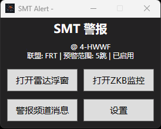
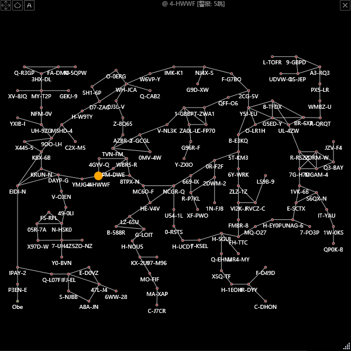
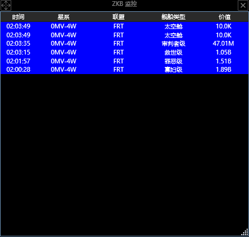
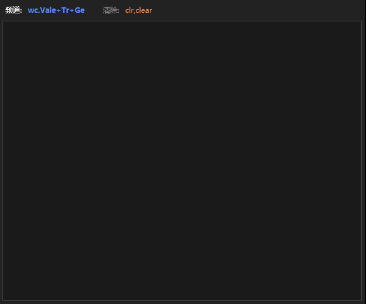
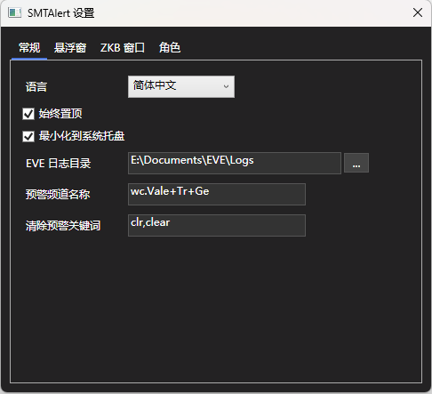

# SMTAlert - EVE Online 预警雷达

从 [SMT (Slazanger's Eve Map Tool)](https://github.com/Slazanger/SMT) 项目中提取的独立 WPF 桌面应用程序，专注提供 EVE Online 的预警雷达悬浮窗和 ZKB 击杀推送功能。

## 功能

- **预警雷达悬浮窗** — 无边框透明地图，显示玩家当前位置周边星系，实时标记预警/清除/过期系统
- **ZKB 击杀推送** — 实时显示当前星域击杀数据，根据声望自动颜色标记
- **ESI 角色管理** — 独立的 ESI SSO 授权，支持多角色、多联盟
- **预警频道监控** — 监控游戏内 Intel 频道，解析星系名并播放报警音
- **中英文双语** — 运行时切换 UI 语言，舰船名称同步翻译

## 编译

### 依赖

| 依赖 | 说明 |
|------|------|
| .NET 8.0 SDK | 编译框架 |
| `EVEData` 项目 | SMT 主项目的数据层，包含星系地图、BFS 导航、ZKB 引擎、ESI 工具类 |
| NAudio 2.2.1 | 报警音播放 |
| Newtonsoft.Json 13.0.4 | JSON 序列化 |
| System.Configuration.ConfigurationManager 8.0.0 | 配置文件管理 |

### 编译步骤

1. 克隆主项目：
   ```
   git clone https://github.com/Slazanger/SMT.git
   ```

2. 将本仓库克隆到 SMT 目录的 `SMTAlert` 子目录：
   ```
   cd SMT
   git clone https://github.com/yuruichang/SMTAlert.git SMTAlert
   ```

3. 使用 Visual Studio 打开 `SMTAlert/SMTAlert.sln` 或命令行编译：
   ```
   dotnet build SMTAlert/SMTAlert.sln --configuration Release
   ```

4. 编译输出在 `SMTAlert/bin/x64/Release/`，直接运行 `SMTAlert.exe`

**注意：** 本项目依赖 EVEData 项目（`..\EVEData\EVEData.csproj`），必须放在 SMT 主项目的同级目录下才能编译。

## 使用说明

1. 启动后首先添加角色 — 点击"添加角色"通过 EVE SSO 授权
2. 授权完成后角色会自动获取位置信息，设置预警范围（1-10 跳）
3. 点击"打开预警雷达悬浮窗"显示星图雷达
4. 点击"打开 ZKB 击杀推送"显示实时击杀数据
5. 在设置中配置预警频道名称和清除关键词

## 更新日志

### v2.1
- **新增 ZKB 公司列** — 显示受害者公司缩写，支持列排序与可见性切换
- **ZKB 行选中优化** — 点击行内任意位置选中整行，选中高亮覆盖全行，右键空白不弹出菜单
- **ZKB 字体大小设置** — 设置中可动态调整字号，行高自动适配
- **ZKB 字体大小设置** — 设置中可动态调整字号，行高自动适配
- **监控支持名称输入** — 角色/公司监控字段支持输入名称（自动反向查找）
- **ZKB 列宽自适应优化** — 内容短时按比例铺满窗口，内容超长时自动滚动
- **设置窗口高度适配** — 移除滚动条，所有选项在同一页完整显示

### v2.0
- ZKB 击杀推送窗口重构（8列动态布局、列排序、可见性切换）
- 击杀者联盟列、星域列、角色列
- 角色/公司 ID 监控（跳过星系过滤）
- 本地时间/游戏时间切换

## 截图







## 许可证

本项目基于原 SMT 项目（MIT 许可证），SMTAlert 的修改和新增代码同样以 MIT 许可证发布。

## 致谢

- [Slazanger/SMT](https://github.com/Slazanger/SMT) — 原始项目
- [EVE Online](https://www.eveonline.com/) — CCP Games
- [zkillboard.com](https://zkillboard.com/) — 击杀数据
- [EVEStandard](https://github.com/gehnge/EVEStandard) — ESI API 库
